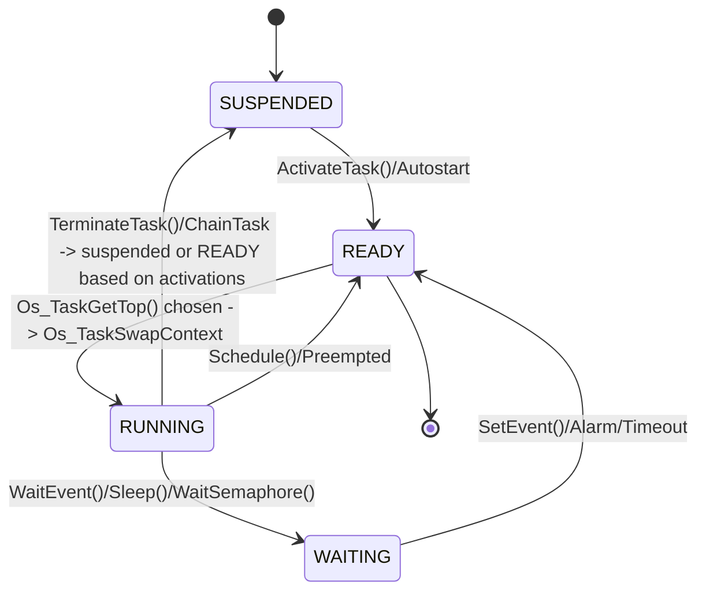
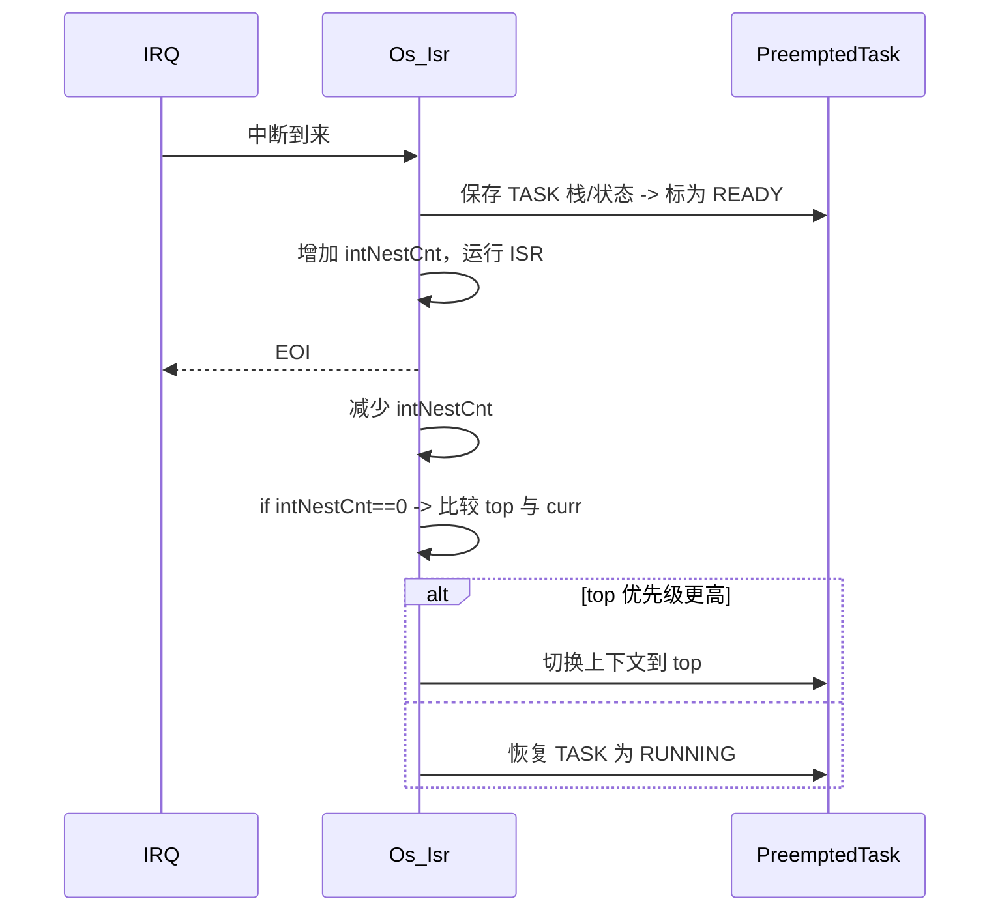
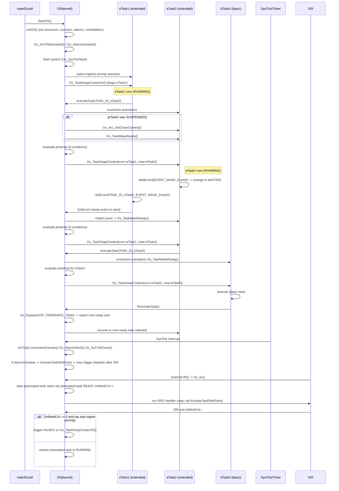

**OS 综述与调度关系（Arctic Core kernel）**

本说明基于 `system/kernel` 下的实现代码（如 `init.c`、`task.c`、`event.c`、`isr.c`、`alarm.c`、`sched_table.c`、`resource.c`、`counter.c` 等）。目标：
- 梳理任务（Task）生命周期与调度关系
- 画出调度 / 抢占 / 中断交互的 Mermaid 图
- 列出对外 API（如何使用 OS）并给出基于 `examples/os_simple` 的最小 demo

**要点（摘要）**
- 内核维护就绪队列 `Os_Sys.ready_head`（TAILQ）; 任务用 `OsTaskVarType` 的 PCB 表示。
- 启动流程：`InitOS()` 初始化结构（建立 PCB、autostart、计时器、报警等），`StartOS()` 调用 `os_start()` 查找优先级最高的 autostart 任务并通过 `Os_TaskSwapContextTo()` 切换到该任务。
- 任务就绪：`ActivateTask()` / `SetEvent()` 会把目标任务从 SUSPENDED 或 WAITING 变为 READY（通过 `Os_TaskMakeReady()`），在合适条件下会触发 `Os_Dispatch()` 进行上下文切换。
- 调度器选择：`Os_TaskGetTop()` 遍历 `ready_head` 找到 activePriority 最大（优先级最高）的任务。
- 上下文切换：`Os_Dispatch()` 根据操作类型（OP_SET_EVENT、OP_SCHEDULE、OP_TERMINATE_TASK 等）把当前任务设为 READY/WAITING/SUSPENDED，然后取 top 并调用 `Os_TaskSwapContext()` 或 `Os_TaskSwapContextTo()` 完成切换。
- 抢占机制：在中断（ISR）中调用激活（ActivateTask/SetEvent）后，若中断返回时`intNestCnt==0`，会比较最高就绪任务与当前任务优先级，必要时触发 PendSV（ARM-CM3）或直接做 `Os_TaskSwapContextTo()` 来切换任务。
- 资源管理：采用优先级天花板（ceiling）协议；`GetResource()` / `ReleaseResource()` 会影响是否允许抢占（`Os_SchedulerResourceIsFree()`）。
- 事件/报警/计时器/计划表：计数器周期触发 `Os_AlarmCheck()` / `Os_SchTblCheck()`，会调用 `ActivateTask()` 或 `SetEvent()`。

**1) 任务生命周期 - Mermaid 状态图**



说明：
- `ActivateTask()` 会增加激活计数（`activations`），若之前为 SUSPENDED 则清上下文并 `Os_TaskMakeReady()`。
- `TerminateTask()` 使用 `Os_Dispatch(OP_TERMINATE_TASK)` 强制重新调度，当前实例结束。

**2) 调度与抢占流程 - Mermaid 流程图**

```mermaid
flowchart TB
  A[ActivateTask/SetEvent/ReleaseResource/Schedule/ChainTask/TerminateTask] --> B[Os_Dispatch(op)]
  B --> C{op -> 调整当前任务状态}
  C --> D[更新当前任务为 READY/WAITING/SUSPENDED]
  D --> E[Os_TaskGetTop() 查找就绪队列最高优先]
  E --> F{top != curr?}
  F -- yes --> G[Os_ResourceReleaseInternal(); Os_TaskSwapContext(curr, top)]
  F -- no  --> H[继续当前任务 / 重新设置栈并开始Basic任务]

  subgraph 中断/ISR
    I[ISR Entry] --> J[Os_Isr(): 保存被打断 task 状态 -> 设置 preempted 为 READY]
    J --> K[执行 ISR2]
    K --> L[ISR exit: 减少 intNestCnt]
    L --> M{intNestCnt==0?}
    M -- yes --> N[Compare Os_TaskGetTop 与 curr 优先级]
    N -- higher --> O[触发上下文切换（PendSV 或 Os_TaskSwapContextTo）]
    N -- no --> P[恢复被打断任务为 RUNNING]
  end

  G --> Z[新任务执行]
  O --> Z
```

说明要点：
- 只有当 `Os_Sys.intNestCnt==0`（不在 ISR）且当前任务可抢占（scheduling==FULL）并且 `Os_SchedulerResourceIsFree()` 时，才会做抢占。
- ARM-CM3 在 ISR 末尾会触发 PendSV 软中断由 PendSV handler 实际完成上下文切换（见代码中写入 `0xE000ED04`）。

**3) 中断与尾链 (Tail chaining)（简化时序图）**



**4) 对外 API（常用）**
- 启动 / 关闭： `StartOS(AppModeType Mode)`, `ShutdownOS(StatusType Error)`
- 任务管理： `ActivateTask(TaskType)`, `TerminateTask()`, `ChainTask(TaskType)`, `Schedule()`, `GetTaskID()`, `GetTaskState()`
- 事件： `SetEvent(TaskType, EventMaskType)`, `WaitEvent(EventMaskType)`, `ClearEvent(EventMaskType)`, `GetEvent()`
- 资源： `GetResource(ResourceType)`, `ReleaseResource(ResourceType)`（优先级天花板）
- 报警/计时器/计划表： `SetRelAlarm`, `SetAbsAlarm`, `CancelAlarm`, `IncrementCounter`, `GetCounterValue`, `StartScheduleTableRel`, `StartScheduleTableAbs`, `GetScheduleTableStatus` 等
- 应用（多应用支持）： `GetApplicationID`, `TerminateApplication`, `AllowAccess`, `CallTrustedFunction`（受限于配置）

这些 API 在 `system/kernel/*.c` 中都有实现（并满足 Autosar OS SWS 要求的行为）。

**5) 使用示例（基于 `examples/os_simple`）**

关键片段（摘自 `examples/os_simple/os_simple.c`）：

```c
void eTask1(void) {
    ActivateTask(TASK_ID_eTask2);
    for(;;) {
        SetEvent(TASK_ID_eTask2, EVENT_MASK_Event2);
        WaitEvent(EVENT_MASK_Event1);
        ClearEvent(EVENT_MASK_Event1);
    }
}

void eTask2(void) {
    for(;;) {
        WaitEvent(EVENT_MASK_Event2);
        ClearEvent(EVENT_MASK_Event2);
        ActivateTask(TASK_ID_bTask3);
    }
}

void bTask3(void) {
    /* basic task should TerminateTask() at end */
    TerminateTask();
}

/* Idle */
void OsIdle(void) { for(;;) { } }

/* main 或 EcuM 初始化后调用 */
int main(void) {
    /* 硬件/外设 初始化 */
    StartOS(OSDEFAULTAPPMODE);
    return 0; /* 不会返回 */
}
```

说明：
- `eTask1` 启动 `eTask2`，并用事件与 `eTask2` 同步；`eTask2` 激活 `bTask3`。
- `bTask3` 是 basic task，执行完后必须调用 `TerminateTask()`。

**6) 构建/运行提示（Windows / Cygwin 环境）**
- 如果使用 Windows 原生的 `arm-none-eabi-gcc.exe`，请用 Windows 风格路径（例如 `C:/compiler/gcc-arm-none-eabi-10.3/bin/arm-none-eabi-`）作为 `CROSS_COMPILE` 前缀。若使用 Cygwin/MSYS 里的 gcc，请确保传入的 `/cygdrive/...` 路径对该 gcc 可见。

示例 make 命令（在 repo 根）：
```
make BOARDDIR=stm32_stm3210c CROSS_COMPILE='C:/compiler/gcc-arm-none-eabi-10.3/bin/arm-none-eabi-' BDIR=examples/os_simple all
```

（若在 Cygwin 环境下使用 native Windows gcc，会导致路径识别错误 — 可用 `cygpath -w` 转换路径或使用 Cygwin 下的工具链。）

**7) 如何阅读代码以理解细节（建议）**
- 从 `InitOS()` / `StartOS()` 阅读启动流程，留意 autostart 与 systick 初始化。
- 阅读 `Os_TaskContextInit()` 和 `Os_TaskGetTop()` 理解 PCB 初始化与就绪队列选择逻辑。
- 阅读 `Os_Dispatch()`、`Os_TaskSwapContext()`、`Os_TaskSwapContextTo()`，把上下文切换流程理清（pretask/posttask hook, resource handling）。
- 阅读 `Os_Isr()`（以及 arch 下的 IRQ/PendSV 实现）理解中断与尾链和抢占细节。
- 阅读 `resource.c` 理解优先级天花板的实现，以及在 `GetResource()`/`ReleaseResource()` 时如何触发重新调度。

---

如果你愿意，我可以：
- 把上面的 mermaid 图以单独 `.mmd` 文件导出；
- 为 `examples/os_simple` 生成更详细的时序动画（mermaid sequence）以示例演示任务切换；
- 或者将图嵌入到仓库的 Wiki 页面。

文件结束。

---

**附加：`examples/os_simple` 的详细时序图（任务切换）**

下面的时序图展示了 `StartOS()` 后，autostart 任务如何运行，以及 `eTask1`、`eTask2`、`bTask3` 三个任务间的典型交互、事件及调度决策点。图中也包含了 SysTick/Alarm 导致的激活，以及中断产生抢占的路径。



说明要点（针对上图）：
- ActivateTask/SetEvent 只把任务标为 READY（并增加 activations），是否立刻抢占取决于：
    - 当前执行上下文是否处于中断（intNestCnt==0）
    - 当前任务是否可抢占（scheduling==FULL）
    - 调度器资源是否空闲（Os_SchedulerResourceIsFree()）
- Basic task 在执行完后必须调用 `TerminateTask()`，Terminate 通过 `Os_Dispatch(OP_TERMINATE_TASK)` 导致选择下一个就绪任务。
- SysTick/软计数器会通过 `OsTick()` -> `IncrementCounter()` -> `Os_AlarmCheck()` / `Os_SchTblCheck()` 激活任务或设置事件，这也可能引发调度点。

**附加：OS 运行时依赖的硬件资源（概览）**

最低要求（核心依赖）：
- 系统节拍源（SysTick 或 通用定时器 GPT）
    - 用于产生 OS tick 以驱动软件计数器、报警与计划表。
    - 相关寄存器（ARM Cortex-M 示例）：`SYST_CSR` (控制/状态), `SYST_RVR` (重载), `SYST_CVR` (当前值)。
- 中断控制器（NVIC / 中断控制单元）
    - 中断向量表、优先级寄存器、使能/挂起/清除寄存器（如 `NVIC_ISER`, `NVIC_ICPR`, `NVIC_IPR` 等）。
    - 用于使能外设中断、设置优先级并对中断进行 EOI/清除。
- PendSV 或等效的软中断/异常用于执行任务上下文切换（ARM Cortex-M 使用 `ICSR` 的 `PENDSVSET`，地址 `0xE000ED04` 写 0x10000000）。
- 时钟（System Clock / HCLK）
    - SysTick 或硬件定时器的时钟来源，需要配置以得到预期的 OS tick 频率（OsTickFreq）。

CPU/寄存器相关（上下文切换要求）：
- 每个任务需独立的栈（任务上下文保存在任务栈中）。
- 上下文保存/恢复：通用寄存器（R0-R12），LR(返回地址)、PC、xPSR，在 ARM Cortex-M 上部分由硬件在异常进入时自动保存（R0-R3,R12,LR,PC,xPSR），其余（R4-R11）由软件保存。
- 特权与中断屏蔽寄存器：`PRIMASK`, `BASEPRI`, `CONTROL` 可用于屏蔽中断或者切换栈指针（MSP/PSP）。

外设驱动与时钟：
- 若使用硬件计时器（GPT）作为计时源，需初始化计时器驱动并在计时器中断中调用 `OsTick()` 或在驱动中驱动 `IncrementCounter()`。
- 外设中断（例如通信、ADC）若在 ISR 中调用 OS 服务（ActivateTask/SetEvent），这些 ISR 必须符合系统对 ISR category（ISR2/ISR1）的要求。

可能的可选硬件（取决于平台/配置）：
- Memory Protection Unit (MPU) 或 MMU：用于应用隔离（SC3/4 等场景）；上下文切换时可能需要切换内存映射。
- Cache 控制器：在任务切换或 DMA 同步时需注意 cache 管理。

硬件初始化注意点：
- 在 `StartOS()` 前或 `InitOS()` 内需完成系统时钟与定时器初始化，确保 `Os_SysTickStart()` 能正确按期触发时钟中断。
- 中断优先级分配要小心：OS 需要较低优先级的 PendSV（最低优先级）以便 ISR 优先处理并由 PendSV 做上下文切换。

---

我已经把本节追加到 `teachyou.md`。接下来我会把本条 TODO 标记为完成，并把 `teachyou.md` 保持为最新版本。

