# AUTOSAR OS 内核深度解析 - 从概念到实现

## 目录
1. [操作系统基础概念](#1-操作系统基础概念)
2. [AUTOSAR OS 架构概览](#2-autosar-os-架构概览)
3. [任务管理详解](#3-任务管理详解)
4. [中断处理机制](#4-中断处理机制)
5. [内存和栈管理](#5-内存和栈管理)
6. [OS与ARM硬件的配合](#6-os与arm硬件的配合)
7. [系统启动流程](#7-系统启动流程)
8. [实际代码分析](#8-实际代码分析)

---

## 1. 操作系统基础概念

### 1.1 什么是操作系统？

操作系统(OS)是管理计算机硬件和软件资源的系统软件，它为应用程序提供服务，主要功能包括：

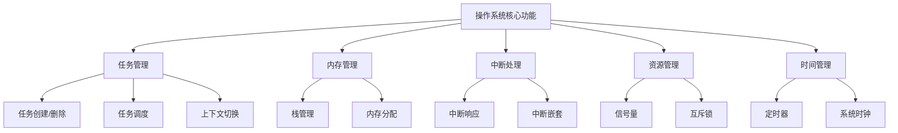

### 1.2 实时操作系统(RTOS)特点

AUTOSAR OS是一个实时操作系统，具有以下特点：

- **确定性响应时间**：中断和任务切换时间可预测
- **优先级调度**：高优先级任务优先执行
- **抢占式调度**：高优先级任务可以抢占低优先级任务
- **资源保护**：防止优先级反转

---

## 2. AUTOSAR OS 架构概览

### 2.1 整体架构

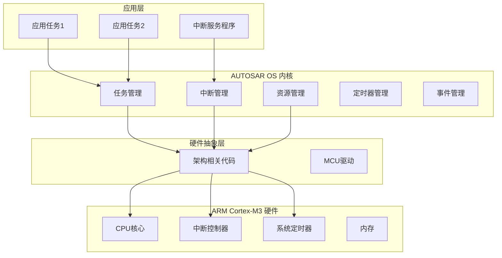

### 2.2 代码目录结构

```
project/
├── system/kernel/          # OS内核核心代码
│   ├── task.c             # 任务管理
│   ├── isr.c              # 中断管理
│   ├── resource.c         # 资源管理
│   ├── alarm.c            # 定时器管理
│   └── init.c             # 系统初始化
├── arch/arm/arm_cm3/      # ARM Cortex-M3架构相关
│   ├── kernel/
│   │   ├── arch.c         # 架构相关函数实现
│   │   ├── irq.c          # 中断处理
│   │   └── core_cm3.h     # 硬件寄存器定义
│   └── drivers/           # 硬件驱动
└── boards/stm32_stm3210c/ # 板级支持包
```

---

## 3. 任务管理详解

### 3.1 任务的概念

任务(Task)是OS调度的基本单位，每个任务都有：
- **独立的栈空间**
- **优先级**
- **状态**
- **上下文**（寄存器值）

### 3.2 任务状态转换

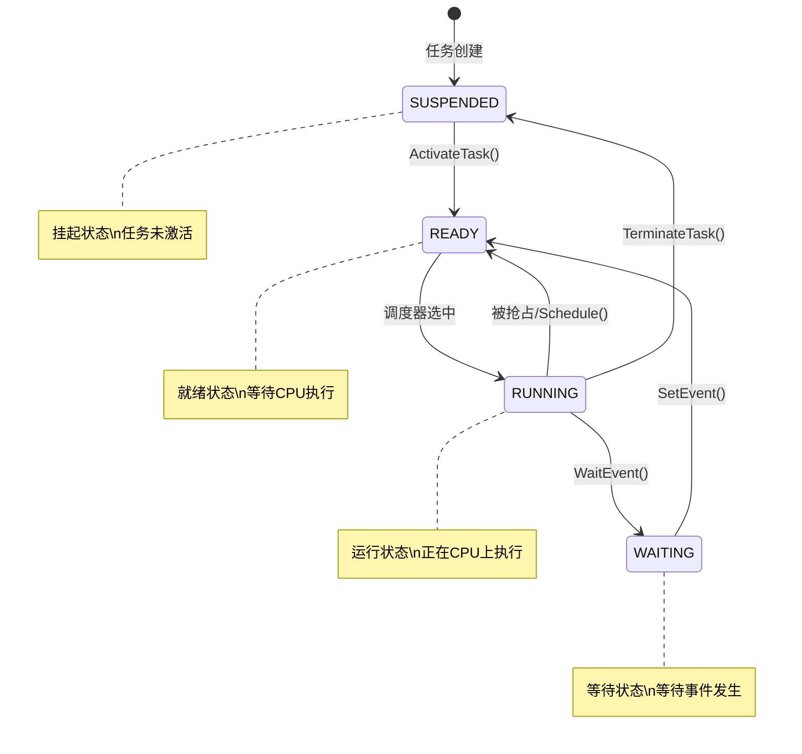

### 3.3 任务控制块(PCB)

每个任务都有一个PCB来保存任务信息：

```c
// 任务控制块结构 (简化版)
typedef struct OsTaskVar {
    OsTaskConstType *constPtr;    // 任务常量信息
    TaskStateType state;          // 任务状态
    OsPriorityType activePriority; // 当前优先级
    uint8_t activations;          // 激活次数
    
    // 栈信息
    struct {
        void *curr;               // 当前栈指针
        void *top;                // 栈顶
        size_t size;              // 栈大小
    } stack;
    
    // 事件信息
    EventMaskType ev_set;         // 已设置的事件
    EventMaskType ev_wait;        // 等待的事件
} OsTaskVarType;
```

### 3.4 任务调度算法

AUTOSAR OS使用**优先级抢占式调度**：

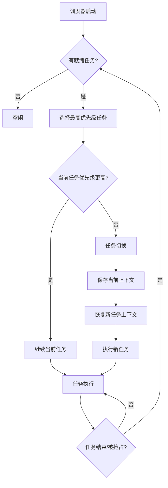

### 3.5 上下文切换详解

上下文切换是OS的核心操作，包括保存和恢复CPU寄存器：

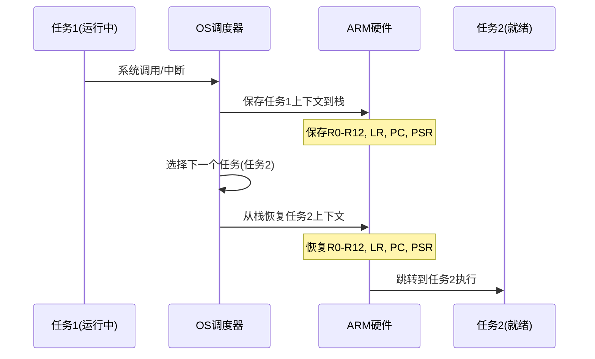

---

## 4. 中断处理机制

### 4.1 中断的概念

中断是硬件向CPU发出的异步信号，用于处理紧急事件：


### 4.2 中断优先级和嵌套

ARM Cortex-M3支持中断嵌套：

```mermaid
gantt
    title 中断嵌套示例
    dateFormat X
    axisFormat %s
    
    section 任务执行
    任务A运行    :active, task, 0, 3
    任务A运行    :active, task, 7, 10
    
    section 低优先级中断
    中断ISR1     :crit, isr1, 3, 5
    中断ISR1     :crit, isr1, 6, 7
    
    section 高优先级中断  
    中断ISR2     :done, isr2, 5, 6
```

### 4.3 中断处理流程

```c
// 中断处理主函数 (简化版)
void *Os_Isr(void *stack, int16_t vector) {
    // 1. 保存被中断任务的上下文
    OsTaskVarType *taskPtr = Os_SysTaskGetCurr();
    taskPtr->stack.curr = stack;
    taskPtr->state = ST_READY;
    
    // 2. 增加中断嵌套计数
    Os_Sys.intNestCnt++;
    
    // 3. 执行中断服务程序
    OsIsrVarType *isrPtr = &Os_IsrVarList[Os_VectorToIsr[vector]];
    isrPtr->constPtr->entry();  // 调用用户ISR
    
    // 4. 减少中断嵌套计数
    Os_Sys.intNestCnt--;
    
    // 5. 如果没有嵌套中断，进行任务调度
    if (Os_Sys.intNestCnt == 0) {
        OsTaskVarType *new_pcb = Os_TaskGetTop();
        if (new_pcb != taskPtr) {
            // 需要任务切换
            Os_TaskSwapContextTo(NULL, new_pcb);
        }
    }
    
    return stack;
}
```

---

## 5. 内存和栈管理

### 5.1 内存布局

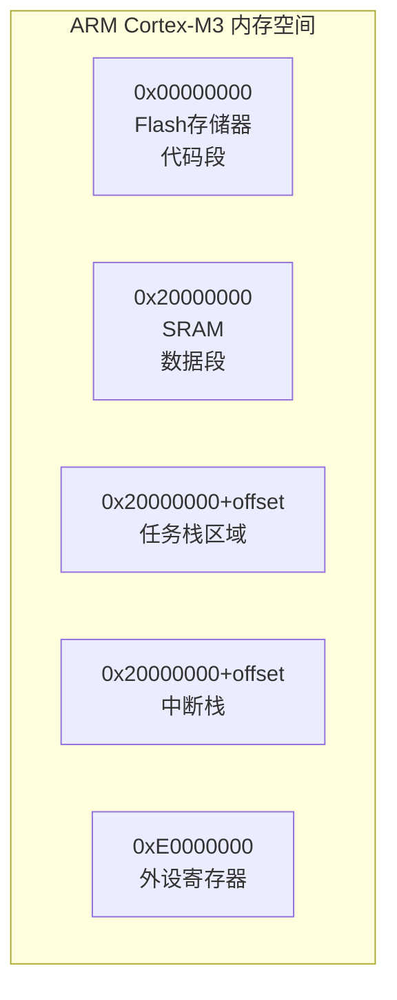

### 5.2 任务栈管理

每个任务都有独立的栈空间：

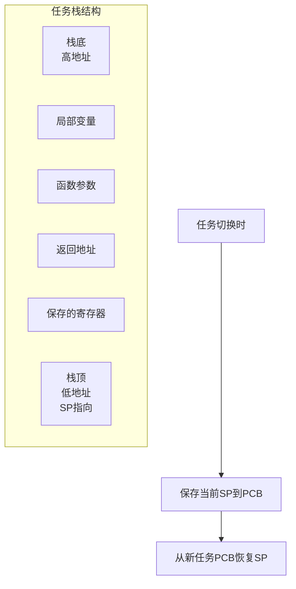

### 5.3 栈溢出检测

```c
// 栈溢出检测机制
void Os_StackSetEndmark(OsTaskVarType *pcbPtr) {
    // 在栈底设置魔数
    uint32_t *bottom = (uint32_t*)pcbPtr->stack.top;
    *bottom = STACK_PATTERN;  // 0x42424242
}

boolean Os_StackIsEndmarkOk(OsTaskVarType *pcbPtr) {
    uint32_t *bottom = (uint32_t*)pcbPtr->stack.top;
    return (*bottom == STACK_PATTERN);
}
```

---

## 6. OS与ARM硬件的配合

### 6.1 关键寄存器映射

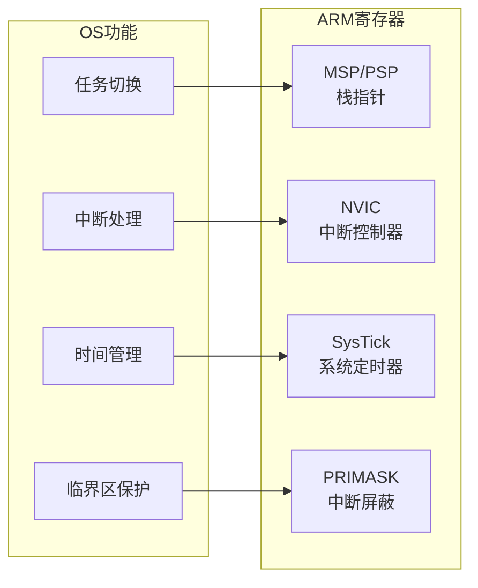

### 6.2 硬件抽象层接口

OS通过硬件抽象层与ARM硬件交互：

```c
// 架构相关接口定义 (arch.h)
void Os_ArchFirstCall(void);           // 首次任务调用
void *Os_ArchGetStackPtr(void);        // 获取栈指针
void Os_ArchSwapContext(void *old, void *new);  // 上下文切换
void Os_ArchSetupContext(OsTaskVarType *pcb);   // 设置任务上下文

// ARM Cortex-M3具体实现 (arch.c)
void *Os_ArchGetStackPtr(void) {
    return (void *)__get_MSP();  // 读取主栈指针寄存器
}
```

### 6.3 中断向量表

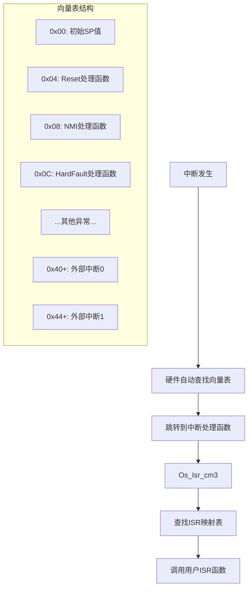

---

## 7. 系统启动流程

### 7.1 启动序列

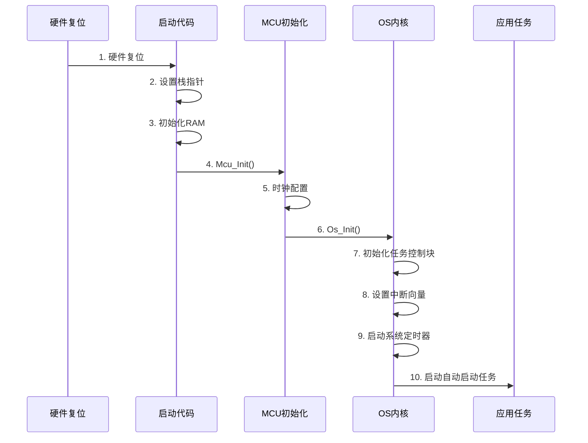

### 7.2 详细启动过程

```c
// 系统初始化主要步骤
void main(void) {
    // 1. MCU硬件初始化
    Mcu_Init(&McuConfigData);
    Mcu_InitClock(0);
    
    // 2. OS内核初始化  
    Os_Init();
    
    // 3. 启动OS调度器
    Os_Start();  // 永不返回
}

void Os_Init(void) {
    // 初始化任务控制块
    for (int i = 0; i < OS_TASK_CNT; i++) {
        Os_TaskContextInit(&Os_TaskVarList[i]);
    }
    
    // 初始化中断系统
    Os_IsrInit();
    
    // 初始化系统定时器
    Os_SysTickInit();
}
```

---

## 8. 实际代码分析

### 8.1 任务激活过程

让我们跟踪一个任务从激活到运行的完整过程：

```c
// 1. 应用调用激活任务
StatusType ActivateTask(TaskType TaskID) {
    OsTaskVarType *pcb = Os_TaskGet(TaskID);
    
    // 增加激活计数
    pcb->activations++;
    
    if (os_pcb_get_state(pcb) == ST_SUSPENDED) {
        // 任务当前是挂起状态，设置为就绪
        Os_Arc_SetCleanContext(pcb);  // 清理上下文
        Os_TaskMakeReady(pcb);        // 加入就绪队列
    }
    
    // 检查是否需要抢占当前任务
    if ((Os_SysTaskGetCurr()->constPtr->scheduling == FULL) &&
        (pcb->activePriority > Os_SysTaskGetCurr()->activePriority)) {
        Os_Dispatch(OP_ACTIVATE_TASK);  // 触发调度
    }
}

// 2. 调度器选择最高优先级任务
OsTaskVarType *Os_TaskGetTop(void) {
    OsTaskVarType *top_prio_pcb = NULL;
    OsPriorityType top_prio = -1;
    
    // 遍历就绪队列，找到最高优先级任务
    TAILQ_FOREACH(i_pcb, &Os_Sys.ready_head, ready_list) {
        if (i_pcb->activePriority > top_prio) {
            top_prio = i_pcb->activePriority;
            top_prio_pcb = i_pcb;
        }
    }
    
    return top_prio_pcb;
}

// 3. 执行任务切换
void Os_TaskSwapContext(OsTaskVarType *old_pcb, OsTaskVarType *new_pcb) {
    // 设置新的当前任务
    Os_SysTaskSetCurr(new_pcb);
    
    // 获取内部资源
    Os_ResourceGetInternal();
    
    // 设置任务为运行状态
    Os_TaskMakeRunning(new_pcb);
    
    // 调用架构相关的上下文切换
    Os_ArchSwapContext(old_pcb, new_pcb);
}
```

### 8.2 中断处理实例

```c
// ARM CM3特定的中断处理
void Os_Isr_cm3(int16_t vector) {
    // 获取中断服务程序信息
    OsIsrVarType *isrPtr = &Os_IsrVarList[Os_VectorToIsr[vector]];
    
    if (isrPtr->constPtr->type == ISR_TYPE_1) {
        // 类型1中断：不能调用OS服务
        isrPtr->constPtr->entry();
        return;
    }
    
    // 类型2中断：可以调用OS服务
    Os_Sys.intNestCnt++;           // 增加嵌套计数
    isrPtr->state = ST_ISR_RUNNING;
    
    Irq_Enable();                  // 允许更高优先级中断
    isrPtr->constPtr->entry();     // 执行用户ISR
    Irq_Disable();                 // 禁止中断
    
    // 检查ISR是否正确释放了资源
    if (Os_IsrOccupiesResources(isrPtr)) {
        Os_IsrResourceFreeAll(isrPtr);
        ERRORHOOK(E_OS_RESOURCE);
    }
    
    isrPtr->state = ST_SUSPENDED;
    Os_Sys.intNestCnt--;
    
    // 触发PendSV进行任务调度
    *((uint32_t volatile *)0xE000ED04) = 0x10000000;
}
```

### 8.3 系统定时器处理

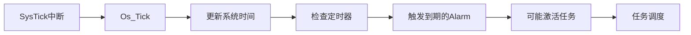

---

## 总结

通过这个深入分析，我们可以看到：

1. **AUTOSAR OS**是一个精心设计的实时操作系统，具有清晰的分层架构
2. **任务管理**通过PCB和优先级调度实现高效的多任务处理
3. **中断处理**利用ARM硬件特性实现快速响应和嵌套支持
4. **硬件抽象**使OS核心代码保持架构无关，便于移植
5. **内存管理**通过独立栈空间和溢出检测保证系统稳定性

这种设计使得AUTOSAR OS既能充分利用ARM Cortex-M3的硬件特性，又保持了良好的可移植性和可维护性，是嵌入式实时系统的优秀实现。

---

*本文档基于Arctic Core开源AUTOSAR OS项目分析编写，适合OS初学者深入理解实时操作系统的工作原理。*