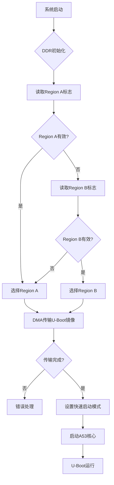

# Bootloader系统分析文档

## 概述
本文档分析了基于AUTOSAR平台的Bootloader系统，主要涉及DDR内存初始化和A53核心U-Boot启动的实现。该系统运行在S32G2XX平台上，支持双区域（Region A/B）冗余启动机制。

## 系统架构

### 硬件平台
- **平台**: S32G2XX CORTEXM
- **目标核心**: ARM Cortex-A53 + Cortex-M7
- **内存系统**: DDR + NOR Flash
- **启动地址**: 0x80090000 (DDR), 0x800A0000 (Reset Handler)

### 核心模块

#### 1. BootloaderSpecific.c
负责底层硬件控制和核心启动管理。

**核心功能模块：**

##### 1.1 平台核心信息管理
```c
Bl_PlatformCoreInfoType Bl_PlatformCoresInformation[7] = {
    {A53_0, PARTITION_1, 0}, // A53核心配置
    {A53_1, PARTITION_1, 1},
    // ... 其他核心配置
};
```

##### 1.2 分区启用函数 (`Bl_EnablePartition`)
- **功能**: 启用指定硬件分区
- **关键步骤**:
  1. 启用分区时钟 (`MC_ME_PARTITION_CLOCK_ENABLE`)
  2. 触发硬件进程并写入密钥序列
  3. 解锁软件复位域控制
  4. 启用互连接口
  5. 集群复位和状态等待

##### 1.3 A53 U-Boot启动函数 (`Bl_StartA53UBoot`)
- **输入**: 无参数
- **输出**: E_OK/E_NOT_OK
- **工作流程**:
  1. 获取应用配置 (`bootApplications[0]`)
  2. 设置核心启动地址 (0x800A0000)
  3. 配置向量表地址到寄存器
  4. 启用分区 (`Bl_EnablePartition`)
  5. 启用核心时钟
  6. 释放核心复位状态
  7. 等待核心启动完成

#### 2. DDR_Mainfunction_UserCall.c
负责DDR初始化、镜像加载和启动流程管理。

**核心功能模块：**

##### 2.1 双区域冗余机制
```c
// 区域有效性标志
static uint8 Region_ValidFlag_Refer[8] = {0x55,0x55,0x55,0x55,0xFF,0xFF,0xFF,0xFF};
// 区域地址配置
static uint32 RegionA_ValidFlag_Addr = 0x014FFF00;
static uint32 RegionB_ValidFlag_Addr = 0x015FFF00;
```

**区域选择逻辑：**
1. 优先检查Region A有效性
2. Region A无效时检查Region B
3. 都无效时默认选择Region A
4. 动态调整NOR Flash物理地址

##### 2.2 主功能状态机 (`DDR_Mainfunction_UserCall`)

**状态流转：**
```
Flag_DDR_Init_Finished = 0 → DDR初始化
Flag_DDR_Init_Finished = 1 → 镜像加载
Flag_DDR_Init_Finished = 2 → U-Boot启动
Flag_DDR_Init_Finished = 3 → 启动完成
```

**详细流程：**

1. **DDR初始化阶段** (Flag = 0)
   - 调用 `Bl_ConfigureDDR()` 初始化DDR内存
   - 状态转移到镜像加载阶段

2. **镜像加载阶段** (Flag = 1)
   - 读取区域有效性标志
   - 选择有效的启动区域
   - 使用DMA传输U-Boot镜像 (3MB, 0x300000)
   - 源地址: NOR Flash (0x9A0000 或 0xDA0000)
   - 目标地址: DDR (0x80090000)

3. **U-Boot启动阶段** (Flag = 2)
   - 检查回滚标志 (`Uboot_Rollback_FLAG`)
   - 设置快速启动模式
   - 清零看门狗计数器
   - 调用 `Bl_StartA53UBoot()` 启动核心

##### 2.3 DMA传输机制
```c
Mcl_DmaChannelTransferListType DmaCommands_App[] = {
    {MCL_DMA_CH_SET_SOURCE_ADDRESS, NorflashPhyAddr},
    {MCL_DMA_CH_SET_DESTINATION_ADDRESS, DDRPhyAddr_1},
    {MCL_DMA_CH_SET_MINORLOOP_SIZE, TransferredSize_App}, // 3MB
    // ... 其他DMA配置
};
```

##### 2.4 快速启动模式 (`SetFastBootMode`)
- 配置启动描述符结构
- 支持回滚模式和强制快速启动
- 设置硬件版本信息
- CRC校验确保数据完整性

## 内存映射

| 组件 | 地址范围 | 用途 |
|------|----------|------|
| NOR Flash Region A | 0x9A0000 | U-Boot镜像存储 |
| NOR Flash Region B | 0xDA0000 | U-Boot镜像备份 |
| DDR目标地址 | 0x80090000 | U-Boot运行地址 |
| 复位处理程序 | 0x800A0000 | 核心启动入口 |
| 快速启动缓冲区 | 0x60080000 | 启动参数存储 |

## 关键特性

### 1. 冗余启动机制
- 双区域镜像存储 (Region A/B)
- 自动故障切换
- 有效性标志验证

### 2. 安全启动
- 密钥序列验证
- CRC校验
- 超时保护机制

### 3. 多核心支持
- A53核心集群管理
- M7核心协处理
- 分区隔离机制

### 4. 性能优化
- DMA批量传输 (3MB一次性传输)
- 硬件加速启动
- 看门狗管理

## 启动流程图



## 错误处理

### 1. 超时保护
- 所有硬件操作都有超时限制
- 防止系统挂起

### 2. 状态验证
- 寄存器状态确认
- 传输完整性检查

### 3. 回滚机制
- 启动失败时自动回滚
- 双区域冗余保证系统可靠性

## 总结

该Bootloader系统采用了先进的冗余机制和硬件加速技术，确保了系统的可靠性和性能。通过双区域存储、DMA传输和多核心管理，实现了高效、安全的U-Boot启动流程。系统设计符合AUTOSAR标准，具有良好的可扩展性和维护性。
