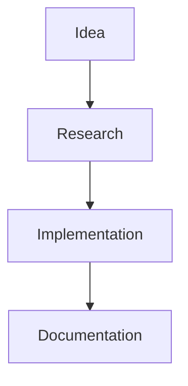

# My Knowledge Base

A GitHub Pages-powered markdown file browser for personal work notes and inspiration.

## Features

✨ **Automatic File Discovery**: Automatically finds and lists all `.md` files in your repository

📱 **Responsive Design**: Clean layout with sidebar navigation and main content area

🔍 **Smart Search**: Search files by name or path with live filtering

🎨 **Rich Markdown Support**:
- GitHub Flavored Markdown
- Syntax highlighting for code blocks
- Mathematical formulas (KaTeX)
- Mermaid diagrams
- Tables, task lists, and more

⌨️ **Keyboard Shortcuts**:
- `Ctrl/Cmd + F`: Focus search box
- `↑/↓ Arrow keys`: Navigate between files

🚀 **Additional Features**:
- File information display
- Scroll position memory
- Back to top button
- Active file highlighting
- Error handling and user feedback

## Setup Instructions

1. **Update Configuration**: 
   - Open `index.html`
   - Replace `'YOUR_USERNAME'` with your actual GitHub username
   - Verify the repository name matches your repo name

2. **Enable GitHub Pages**:
   - Go to your repository settings
   - Navigate to "Pages" section
   - Select source branch (usually `main` or `master`)
   - Your site will be available at: `https://your-username.github.io/NoteBook`

3. **Add Your Markdown Files**:
   - Create `.md` files anywhere in your repository
   - They will automatically appear in the sidebar
   - Organize them in folders if needed

## Example File Structure

```
NoteBook/
├── index.html              # Main application
├── README.md              # This file
├── work-notes/
│   ├── project-ideas.md
│   └── meeting-notes.md
├── learning/
│   ├── javascript-tips.md
│   └── design-patterns.md
└── inspiration/
    └── random-thoughts.md
```

## Markdown Examples

Your files support all GitHub Flavored Markdown features:

### Code Blocks
```javascript
function hello() {
    console.log("Hello, World!");
}
```

### Math Formulas
$E = mc^2$

### Task Lists
- [x] Set up knowledge base
- [ ] Add more notes
- [ ] Organize by categories

### Mermaid Diagrams


Enjoy your personal knowledge base! 📚