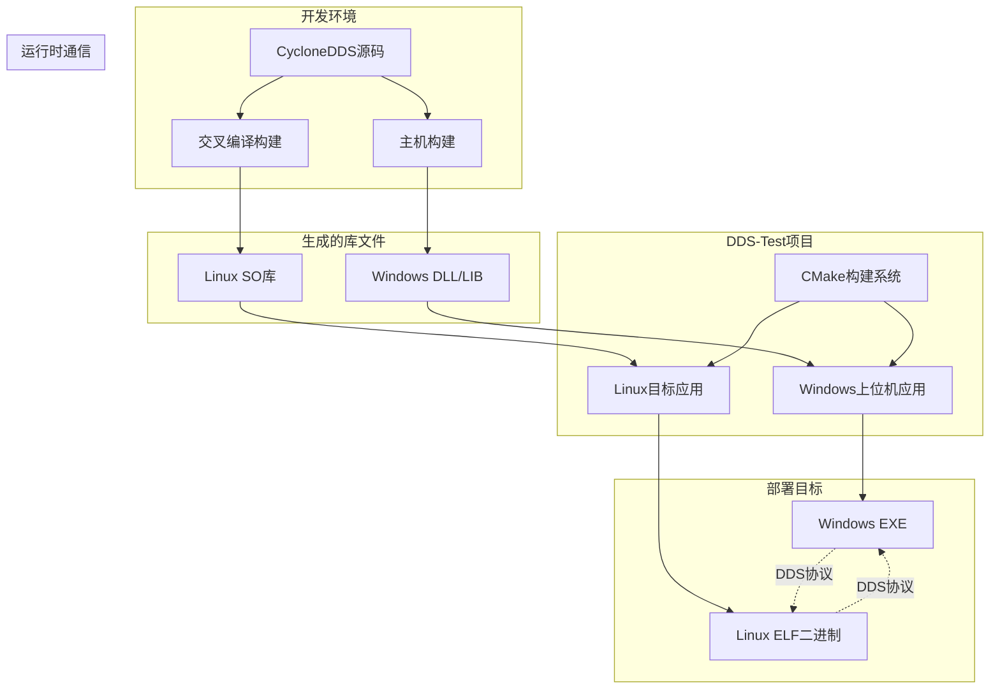
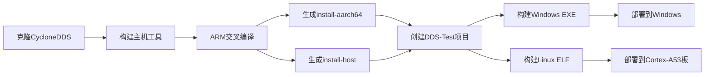
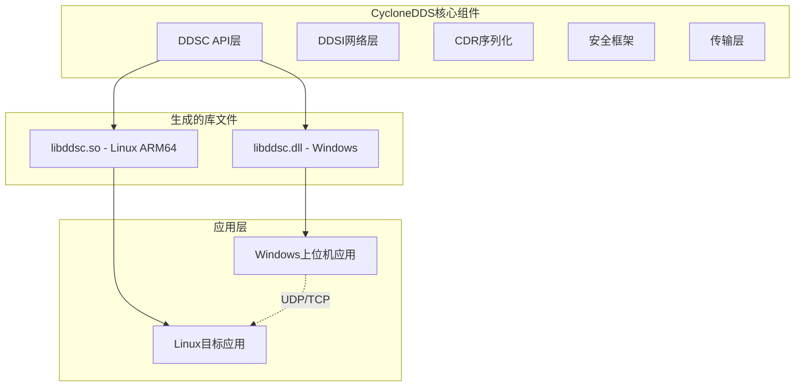

# CycloneDDS学习指南：从入门到精通

## 1. 简介

### 项目目标
本综合指南旨在通过构建完整的分布式通信系统来帮助您掌握CycloneDDS。您将学习：

- 开发**Windows上位机应用程序**用于上层控制和监控
- 创建**Cortex-A53板端应用程序**用于嵌入式目标系统
- 实现Windows和嵌入式Linux平台之间的**实时数据传输**
- 使用CycloneDDS的**往返示例(ping-pong)**作为通信基础

### 目标架构
- **上位机系统**：基于Windows的上位机，用于开发和监控
- **目标系统**：运行Linux的基于Cortex-A53的嵌入式板
- **通信协议**：使用CycloneDDS实现的DDS(数据分发服务)
- **数据交换**：使用发布-订阅模式的双向通信

### 学习成果
完成本指南后，您将理解：
- DDS基础知识和CycloneDDS架构
- 基于ARM系统的交叉编译技术
- 实时通信协议和QoS管理
- 分布式系统开发和调试
- Windows和嵌入式Linux系统之间的集成

## 2. 系统架构框架

### 整体系统设计



### 构建流程



### 组件架构



## 3. 详细实现过程

### 3.1 环境设置和前提条件

根据`techyou.md`中记录的项目设置，确保您已安装：

- **CMake** (3.16版本或更高) ✓
- **ARM GNU工具链** 安装在 `C:\compiler\aarch64-none-linux-gnu` ✓
- **PowerShell** 或命令提示符
- **Git** 用于版本控制
- 开发系统和目标系统之间的**网络连接**

### 3.2 CycloneDDS库生成

编译过程遵循`techyou.md`中详述的两阶段方法：

#### 阶段1：构建主机工具
```powershell
# 导航到CycloneDDS源码目录
cd d:\11_web\cyclonedds

# 创建和配置主机构建
mkdir build-host
cd build-host

# 使用MinGW Makefiles构建（推荐）
cmake -G "MinGW Makefiles" ^
  -DCMAKE_MAKE_PROGRAM=mingw32-make.exe ^
  -DCMAKE_BUILD_TYPE=Release ^
  -DBUILD_EXAMPLES=OFF ^
  -DBUILD_TESTING=OFF ^
  ..

# 编译和安装
cmake --build .
cmake --install . --prefix ../install-host
cd ..
```

#### 阶段2：为Cortex-A53交叉编译
```powershell
# 创建和配置交叉编译构建
mkdir build-aarch64
cd build-aarch64

# 使用ARM交叉编译器配置
cmake -G "MinGW Makefiles" ^
  -DCMAKE_MAKE_PROGRAM=mingw32-make.exe ^
  -DCMAKE_C_COMPILER=C:/compiler/aarch64-none-linux-gnu/bin/aarch64-none-linux-gnu-gcc.exe ^
  -DCMAKE_CXX_COMPILER=C:/compiler/aarch64-none-linux-gnu/bin/aarch64-none-linux-gnu-g++.exe ^
  -DCMAKE_SYSTEM_NAME=Linux ^
  -DCMAKE_SYSTEM_PROCESSOR=aarch64 ^
  -DBUILD_TESTING=ON ^
  ..

# 构建和安装
cmake --build .
cmake --install . --prefix ../install-aarch64
cd ..
```

#### 生成的目录结构
成功编译后，您将拥有：

```
cyclonedds/
├── install-host/          # Windows库和工具
│   ├── bin/              # Windows可执行文件和DLL
│   ├── include/          # 头文件
│   └── lib/              # Windows静态/导入库
├── install-aarch64/       # Linux ARM64库
│   ├── include/          # 头文件  
│   └── lib/              # Linux共享对象（.so文件）
└── build-*/              # 构建目录（可以删除）
```

### 3.3 DDS-Test项目开发

基于`tddstest.md`文档，独立的DDS-Test项目实现实际应用程序：

#### 项目结构
```
DDS_test/
├── install-aarch64/         # 从CycloneDDS构建复制
├── test/                    # Windows应用程序
│   ├── install-host/        # 从CycloneDDS构建复制
│   ├── main.c              # Windows上位机程序
│   └── CMakeLists.txt      # Windows构建配置
├── src/                     # Linux应用程序  
│   └── main.c              # Linux目标程序
├── CMakeLists.txt          # Linux交叉编译配置
└── README.md
```

#### 关键实现特性

**Linux目标应用程序（`src/main.c`）**：
- 创建DDS参与者、主题、写入器和读取器
- 实现基本的DDS通信功能
- 针对嵌入式Linux系统优化
- IP地址：172.16.12.102

**Windows上位机应用程序（`test/main.c`）**：
- 创建DDS参与者、主题、写入器和读取器
- 循环发送周期性消息（0-15计数器，每秒递增）
- 监听来自目标板的消息
- IP地址：172.16.12.200
- 主题名称："DDSTestTopic"

#### 通信协议
应用程序实现车辆电子通信场景：
- **发布者**：Windows上位机通过"DDSTestTopic"发送递增计数器（0-15）
- **订阅者**：Linux目标接收并验证数据
- **QoS**：具有适当持久性设置的可靠通信
- **发现**：无代理的自动对等发现

### 3.4 DDS-Test应用程序构建过程

#### Linux目标应用程序
```bash
# 在DDS_test目录中
mkdir build-aarch64
cd build-aarch64

# 为ARM64交叉编译
cmake -G "MinGW Makefiles" -DCMAKE_MAKE_PROGRAM=mingw32-make.exe ..
mingw32-make

# 生成：ddstest.out
```

#### Windows上位机应用程序  
```bash
# 在DDS_test/test目录中
mkdir build
cd build

# 为Windows编译
cmake -G "MinGW Makefiles" -DCMAKE_MAKE_PROGRAM=mingw32-make.exe ..
mingw32-make

# 生成：ddstest-host.exe
```

## 4. 高级主题和调试

### 4.1 远程调试设置

对于嵌入式开发，远程调试是必不可少的：

**目标板（Linux ARM64）**：
```bash
# 启动GDB服务器
gdbserver :1234 ./ddstest.out
```

**开发主机（Windows）**：
```bash
# 使用交叉GDB连接
aarch64-none-linux-gnu-gdb
target remote 172.16.12.102:1234
set solib-search-path ../install-aarch64/lib
continue
```

### 4.2 网络分析

使用Wireshark分析DDS通信：
- **预期数据包**：INFO_DST, INFO_TS, DATA(p), HEARTBEAT, ACKNACK
- **协议**：RTPS（实时发布-订阅）
- **端口**：默认DDS发现和数据端口
- **多播**：DDS使用多播进行发现

### 4.3 常见问题和解决方案

**通信问题**：
- 验证防火墙设置允许DDS端口
- 检查172.16.12.200和172.16.12.102之间的网络连接
- 确保两个应用程序使用相同的域ID和主题名称
- 验证QoS策略兼容性

**构建问题**：
- 验证CMake配置中的编译器路径
- 检查安装目录包含所需的库
- 确保设置了正确的库搜索路径

**运行时问题**：
- 使用内置日志监控DDS发现过程
- 检查系统资源和线程限制
- 验证自定义数据类型的序列化/反序列化

## 5. 性能优化

### 5.1 延迟优化
- 使用适当的QoS策略（KEEP_LAST, RELIABLE）
- 为您的网络配置传输参数
- 考虑为同主机通信使用共享内存传输

### 5.2 吞吐量优化
- 尽可能批处理多个样本
- 使用适当的缓冲区大小
- 根据可用内存配置资源限制

### 5.3 内存管理
- 监控嵌入式系统中的内存使用
- 配置资源管理的水位线
- 在可用时使用零拷贝机制

## 6. 与实际系统的集成

### 6.1 车辆电子集成
- 实现CAN到DDS的网关
- 处理实时约束和确定性行为
- 与汽车中间件框架集成

### 6.2 工业物联网应用
- 连接到SCADA系统
- 实现边缘到云的数据管道
- 处理工业网络的安全要求

### 6.3 机器人集成
- ROS 2兼容性和集成
- 实时控制环路实现
- 多机器人协调场景

## 7. 下一步和高级学习

### 7.1 高级DDS特性
- **安全**：身份验证、加密、访问控制
- **XTypes**：动态类型定义和演进
- **共享内存**：使用Iceoryx的零拷贝通信
- **QoS策略**：高级可靠性和性能调优

### 7.2 生产部署
- 使用XML文件进行配置管理
- 监控和诊断
- 高可用性和容错
- 性能基准测试和优化

### 7.3 扩展应用
- 多节点分布式系统
- 云集成和混合部署
- 自定义传输实现
- 域桥接和协议转换

## 8. 参考资料和资源

### 官方文档
- [CycloneDDS GitHub仓库](https://github.com/eclipse-cyclonedds/cyclonedds)
- [OMG DDS规范](https://www.omg.org/spec/DDS/)
- [Eclipse CycloneDX项目](https://cyclonedx.org/)

### 开发工具
- [ARM GNU工具链](https://developer.arm.com/tools-and-software/open-source-software/developer-tools/gnu-toolchain)
- [CMake文档](https://cmake.org/documentation/)
- [Wireshark DDS分析](https://www.wireshark.org/)

### 学习材料
- DDS规范和最佳实践
- 实时系统开发
- 交叉编译技术
- 网络协议分析

---

本指南为掌握CycloneDDS开发提供了从基本概念到高级生产部署的全面基础。理论知识和实践实现的结合确保您能够为实际应用构建强大的分布式通信系统。